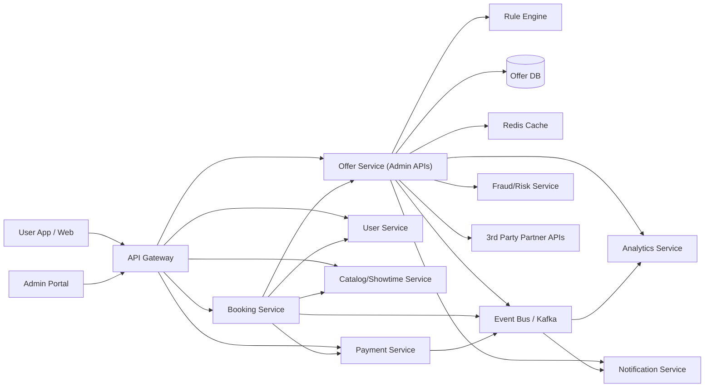
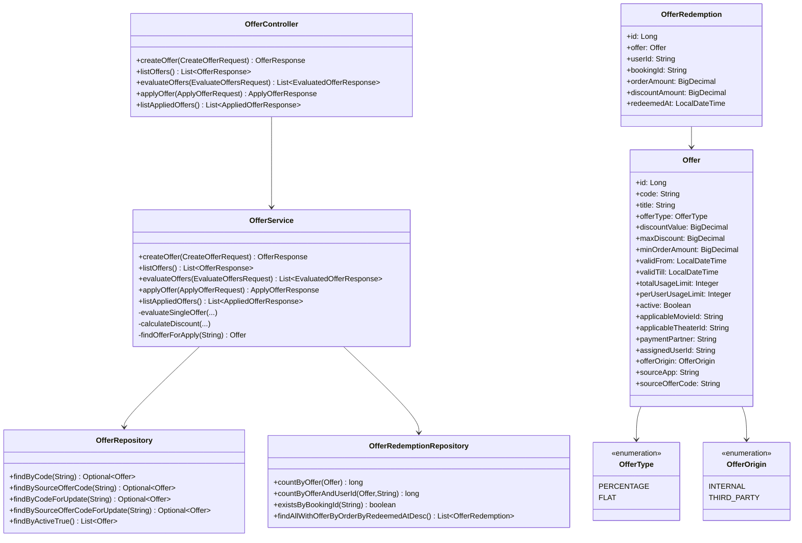

# Movie Booking Platform Case Study: Offer Feature (H2-backed)

## 1) Selected Backend Feature
Implemented feature: **Offer Management + Offer Evaluation + Offer Application + Applied-Offer Tracking**.

This service supports:
- Creating internal and third-party promotional offers.
- User-specific offers (assigned to a specific user).
- Evaluating eligible offers for a booking context.
- Applying an offer transactionally to a booking.
- Listing all applied offers (redemption history).

## 2) HLD / LLD Diagram

## 2.1) High Level Design (HLD)

## 2.2) Low Level Design (LLD)

## 3) API Design
Base path: `/api/v1/offers`

- `POST /api/v1/offers`
  - Creates an offer.
  - Supports:
    - `offerOrigin`: `INTERNAL` / `THIRD_PARTY`
    - `assignedUserId` for user-specific campaigns
    - `sourceApp`, `sourceOfferCode` for third-party campaigns

- `GET /api/v1/offers`
  - Lists all configured offers.

- `POST /api/v1/offers/evaluate`
  - Returns eligible offers sorted by highest discount.
  - Inputs include: `userId`, `movieId`, `theaterId`, `paymentPartner`, `sourceApp`, `orderAmount`.

- `POST /api/v1/offers/apply`
  - Applies an offer to a booking (transactional).
  - Supports lookup by internal `code` or third-party `sourceOfferCode`.
  - Inputs include: `code`, `userId`, `bookingId`, `movieId`, `theaterId`, `paymentPartner`, `sourceApp`, `orderAmount`.
  - Uses DB locking to reduce race conditions during concurrent applies.

- `GET /api/v1/offers/applied`
  - Returns applied offers (redemptions), latest first.

## 4) Database Design
### `offers`
- `id` PK
- `code` unique
- `title`, 
- `description`
- `offer_type` (`PERCENTAGE`/`FLAT`)
- `discount_value`, 
- `max_discount`, 
- `min_order_amount`
- `valid_from`, 
- `valid_till`
- `total_usage_limit`, 
- `per_user_usage_limit`
- `active`
- `applicable_movie_id`, 
- `applicable_theater_id`, 
- `payment_partner`
- `assigned_user_id` (user-scoped campaigns)
- `offer_origin` (`INTERNAL`/`THIRD_PARTY`)
- `source_app`, 
- `source_offer_code` (third-party mapping)
- `created_at`, 
- `updated_at`

### `offer_redemptions`
- `id` PK
- `offer_id` FK -> offers.id
- `user_id`
- `booking_id` unique (idempotency guard)
- `order_amount`, 
- `discount_amount`
- `redeemed_at`

## 5) Scale, Security, Payments, Availability
- Scale:
  - Stateless service; horizontal scaling behind load balancer.
  - Cache active/evaluable offers for heavy read traffic (`/evaluate`).
  - Production DB migration target: PostgreSQL/MySQL with proper indexing.

- Availability:
  - Multi-instance deployment and rolling updates.
  - Graceful fallback path in booking flow (continue booking without discount).

- Security:
  - API gateway with JWT/OAuth2.
  - Admin authorization for create/update offer endpoints.
  - Validation + audit logging for create/apply operations.

- Payments & Integrations:
  - `paymentPartner` and `sourceApp` support partner campaigns.
  - Third-party code translation through `sourceOfferCode`.

## 6) Tech Choices and Hosting
- Tech: Java, Spring Boot, Spring Data JPA, H2.
- API documentation: OpenAPI/Swagger UI.
  - Swagger UI: `/swagger-ui.html`
  - OpenAPI JSON: `/v3/api-docs`
- Runtime DB options:
  - In-memory H2 for local quick runs/tests.
  - File-based H2 for persisted local development.
- Production target: containerized deployment on Kubernetes + managed RDBMS + Redis + API gateway.

## 7) Delivery Plan
1. Phase 1: Core offer CRUD, evaluate, apply, constraints, tests.
2. Phase 2: User-specific and third-party offer support.
3. Phase 3: Operational hardening (authz, audits, observability, load tests).

## 8) Code Artifact Implemented
Implemented in this repository:
- Offer domain models, repositories, service layer, controllers, and exception handling.
- Startup seed data via `data.sql`.
- Swagger/OpenAPI integration.
- Integration tests covering:
  - create/list
  - evaluate/apply
  - per-user limits
  - user-specific offers
  - third-party code application
  - listing applied offers
